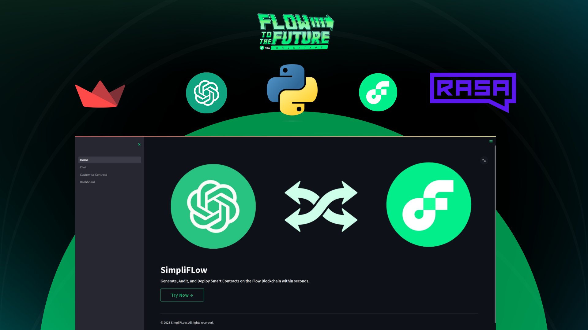
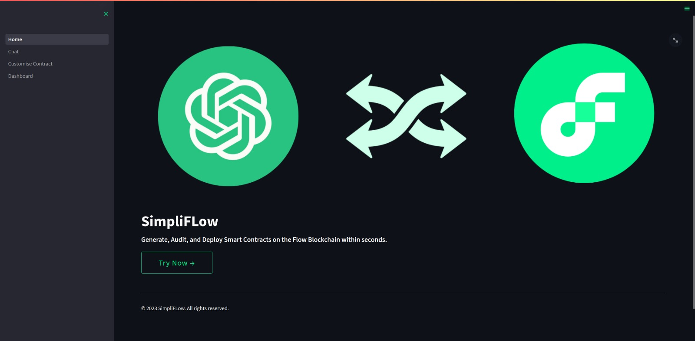
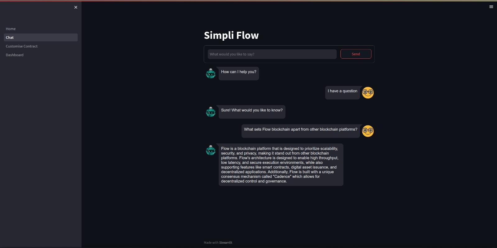
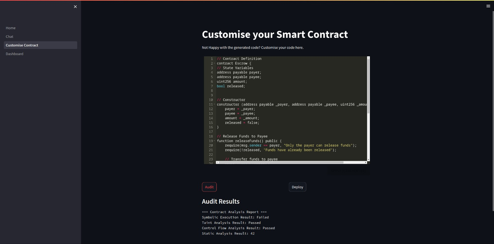
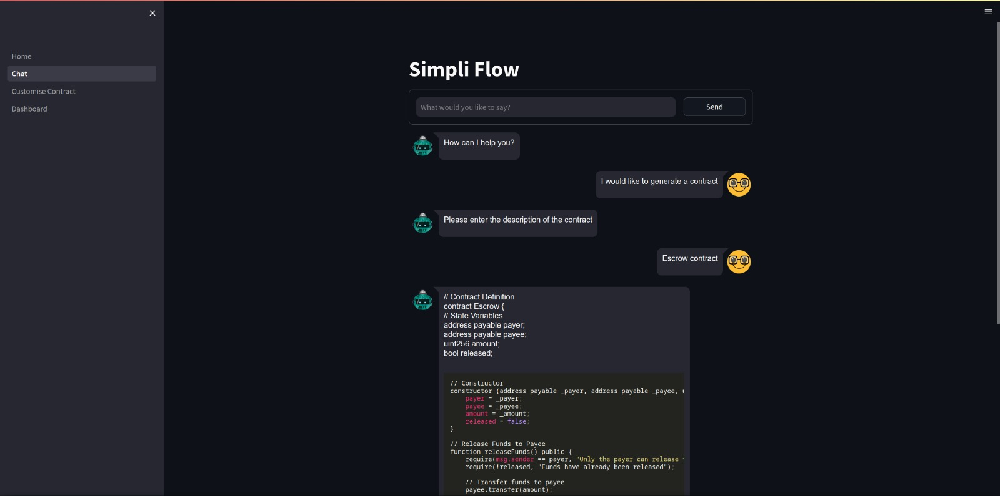
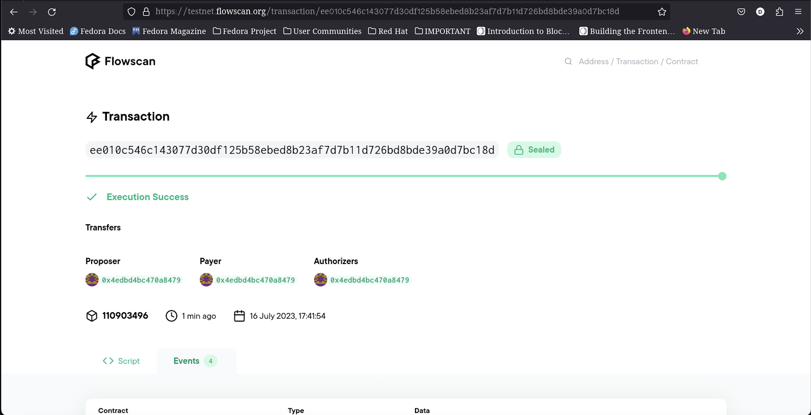

  

  
  

## FLOW HACKATHON SEASON 2

# SIMPLI FLOW

 

 The fastest way to build onFlow

Simpli Flow is an all-in-one solution designed to revolutionize blockchain interactions on the Flow blockchain. With its comprehensive features and user-friendly interface, Simpli Flow empowers users and developers to seamlessly navigate the complexities of the Flow blockchain ecosystem. Powered by a self-trained GPT model, Simpli Flow combines advanced artificial intelligence with blockchain expertise to offer an unparalleled experience in auditing, building, adapting, creating, and deploying contracts, transactions, and providing general answers, providing an accessible, efficient, and all-encompassing solution for the Flow blockchain.

> Read more [here](https://www.canva.com/design/DAFozPhX16g/odBtDJdgRgdFohjFqJycqA/view?utm_content=DAFozPhX16g&utm_campaign=designshare&utm_medium=link&utm_source=publishsharelink)

## Features

- Dynamic Contract Building: Build contracts effortlessly with Simpli Flow's intuitive interface. Users can leverage the power of the GPT model to generate contract templates, adapt existing contracts to meet specific requirements, and explore a vast library of pre-built contract components

- Adaptive Transaction Management: Simpli Flow adapts to the ever-evolving needs of developers and users by offering intelligent transaction management. It assists in constructing efficient transaction structures, optimising gas usage, and ensuring transactions align with the desired objectives.

- Smart Contract Auditing: Simpli Flow leverages its AI capabilities to analyze smart contracts, identifying potential vulnerabilities and providing comprehensive audit reports. Developers can trust in the system's ability to enhance the security and reliability of their contracts.

- Intelligent Answers: Simpli Flow isn't just limited to technical tasks. Users can ask general questions about the Flow blockchain, protocols, and ecosystem, receiving accurate and helpful answers from the AI-powered system. It serves as a knowledgeable companion, providing insights and explanations on-demand.

- Seamless Deployment: Simpli Flow streamlines the deployment process, simplifying the complexities of interacting with the Flow blockchain. Users can effortlessly deploy contracts and transactions, ensuring a smooth transition from development to production.

- Continuous Learning and Improvement: Simpli Flow utilizes a self-training AI model that continually learns and adapts to the evolving Flow blockchain ecosystem. Regular updates and enhancements ensure that users and developers stay up-to-date with the latest advancements, protocols, and best practices.

## Tech stack

- Python
- Streamlit
- Flow blockchain
- RASA
- Natural Language Processing (NLP)
- OpenAI
- Flow python-sdk

## Project Gallery

    
&nbsp;
    

    
&nbsp;
    

 
    

    
&nbsp;
    

## Meet the Team

<table cellpadding="0" align="center">
  <tr style="padding: 0">
    <td valign="top">

  
  <h3>Karthik S</h3>
  

</td>
    <td valign="top">

  
  <h3>Advit Mahale</h3>
  

</td>
    <td valign="top">

  
  <h3>Disha Dwivedi</h3>
  

</td>
    <td valign="top">

  
  <h3>Gaurav Kabra</h3>
  

</td>
  </tr>
</table>
